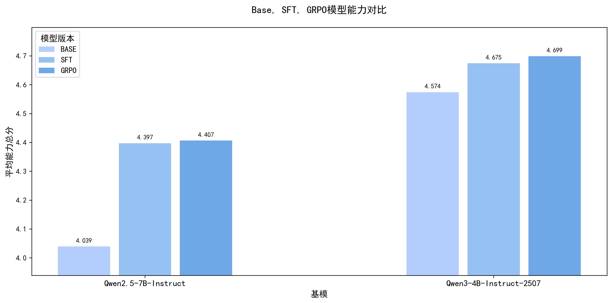

# AdGenius: 品牌专属AI文案专家
一个基于SFT与RLHF(GRPO)的全链路微调项目，旨在为特定品牌打造深度对齐的AI内容生成引擎。

## 1. 项目简介
本项目旨在解决品牌在内容创作中面临的核心痛点：品牌声音不统一、内容生产效率低下、以及通用大模型无法体现品牌独特人格。

我们以科学护肤品牌**“原素方程 (Elemental Equation)”**为虚拟客户，成功端到端地构建、训练并评测了一个品牌专属的AI文案专家——AdGenius。该模型深刻理解“原素方程”冷静、专业、科学的品牌调性，能够自动化地为多个营销渠道生成高质量、风格一致的营销文案。

这个仓库记录了从数据工程、SFT监督微调、奖励模型训练，到最终通过GRPO进行偏好对齐的全链路实现过程。

## 2. 核心功能
AdGenius 经过专门训练，具备为“原素方程”生成多种核心内容类型的能力：

- 社交媒体内容:
  - 种草笔记 (review): 模仿真实用户口吻，分享使用感受。
  - 科普教育 (educational): 以“护肤小课堂”形式，深入浅出地讲解成分与原理。
  - 破除迷思 (myth_busting): 挑战护肤误区，引发社区讨论。
  - 场景故事 (storytelling): 将产品融入真实生活场景，建立情感连接。

- 电商平台文案:
  - 核心介绍长文案 (long_form): 撰写专业、详实、逻辑清晰的产品详情页文案，建立用户信任。

- 付费广告文案:
  - 经典三段式 (cta): 撰写“钩子+利益点+行动号召”的经典广告文案。
  - 痛点放大式 (pas): 采用“痛点-放大-解决”框架，激发用户共鸣。
  - 效果对比式 (bab): 通过“之前-之后-桥梁”的对比，塑造美好愿景。
  - 卖点深挖式 (fab): 使用“特点-优势-好处”的逻辑，理性说服用户。

## 3. 技术深度解析

本项目的核心在于一套严谨、可复现的全链路微调管线。

### 3.1. 基础模型与硬件
基础模型: `Qwen/Qwen2.5-7B-Instruct`, `Qwen/Qwen3-4B-Instruct-2507`

奖励模型(RM)基础: `Skywork/Skywork-Reward-V2-Qwen3-4B`

训练硬件: 2x `NVIDIA H20 96GB GPU` (GRPO); 1× `NVIDIA A800 80GB GPU` (SFT/奖励模型训练)

### 3.2. 数据工程：项目的灵魂
高质量、多样化的数据集是项目成功的基石。我们通过“Prompt即代码”的方式，系统性地构建了SFT和RM数据集。

最终产出：`data/val_dataset_final.jsonl`(验证数据集), `data/rm_dataset_final.jsonl`(构建了chosen-rejected对的奖励数据集), `data/sft_dataset_final.jsonl`(SFT数据集), `sft_datset_final.parquet/val_datset_final.parquet`(VeRL所需GRPO数据集)。

对于data/下的其他文件，都是数据工程过程中的中间产物或辅助脚本。具体的详细过程可以看doc/项目记录.md，这里不详细赘述

#### SFT数据集构建

产品目录构建: 首先，我们为“原素方程”品牌虚构了一个包含70+款产品的详细目录 (products.csv)，涵盖了产品名、品类、核心成分、特点和目标人群。

多样化指令设计: 我们没有使用单一的指令，而是通过在sft_gen_prompts.py中设计了9种不同角色、不同侧重点的“元提示”(Meta-Prompts)，覆盖了社交媒体的4个角度、电商详情页的1个角度，以及付费广告的4个经典文案框架。

API辅助生成: 利用强大的“教师模型”（DeepSeek-V3-0324）的API，将产品信息与多样化的元提示结合，自动化地生成了数百条高质量的文案初稿。

严格清洗与校验: 对API生成的初稿，我们进行了两轮清洗：

格式统一化, 去除杂乱字符: 检查JSON格式、过滤异常长度、去除高度相似的文案。

补充CTA: 对没有CTA的广告文案的最后添加CTA

#### 奖励模型数据集构建

为了教会模型我们的“品味”，我们为RM构建了一个包含chosen和rejected回答的偏好数据集。

- chosen (正向样本): 直接复用SFT数据集中经过严格清洗的“黄金”output。

- rejected (负向样本): 为了让模型学会分辨“平庸”、“夸张”和“错误”，我们采用了三种策略系统性地生成负样本：

弱模型+弱Prompt (制造平庸): 使用未经微调的基础模型和极简的Prompt，生成AI味十足的通用文案。

夸大宣传 (制造品牌违规): 设计了专门的“反派角色”Prompt，故意让模型生成违反品牌指南、充满噱头和夸张承诺的文案。

事实错误 (制造硬负样本): 设计Prompt，指示大模型在保持高质量文案风格的同时，对SFT的“黄金”output进行微小的、与input信息相悖的事实篡改（如修改成分浓度、适用人群等）。

### 3.3. 三阶段模型训练

用到的各种脚本都放在了train/下，详细的过程记录都放在了doc/项目记录.md

- SFT (监督微调):

使用trl库的SFTTrainer，在SFT数据集上对基础模型进行微调，使其初步掌握品牌风格和任务格式。

- RM训练 (奖励模型微调):

使用trl库的RewardTrainer，在RM偏好数据集上，对一个预训练的奖励模型进行微调，最终产出了一个能准确预测我们品牌偏好的“专属评委”。

- RLHF (GRPO 偏好对齐):

我们采用了**GRPO (Grouped Ranking Preference Optimization)**算法。

使用verl框架，将在SFT阶段训练好的模型作为Actor，我们自己训练的奖励模型作为Reward Model，进行了最终的偏好对齐训练。

### 3.4. 评测体系：LLM as a Judge

我们设计了一套严谨的“AI作为裁判”的自动化评测体系来量化模型的效果。

Benchmark设立: 对比三个模型：Base Model(原始基础模型), SFT Model(仅SFT), GRPO Model(SFT+GRPO)。

评测维度设计: 针对不同渠道的文案，设计了不同的评测维度和打分标准，例如：

社交媒体: 重点评测“人设真实感与故事代入感”、“内容价值与互动潜力”。

电商平台: 重点评测“转化导向结构与可扫描性”、“专业性与说服力”。

Prompt即代码: 将评测标准封装在judge_prompts.py中，通过脚本自动化调用大模型API进行打分，确保了评测的可复现性和一致性。

起初的设计是同时接收三个模型的输入后打分(`judge.py`和`judge_prompts.py`)，这样不利于自由的模型对比，耦合太强；后续又转为用同一套prompt和脚本对单个模型的输出单独打分(`judge_new.py`和`judge_prompts_new.py`)。所有模型回答均放在responses/下，所有评测结果均放在results/下

## 4. 最终成果与分析

在LLM as a Judge的评分上，SFT模型在相较于基础模型有不错的效果，GRPO模型相较于SFT模型也有少量提升。

**回答示例：**

prompt:

>请为"原素方程"品牌的如下产品创作一条钩子+利益点+行动号召风格的付费广告文案
>
>{"product_name: "苹果舒缓精油", "category": "精油/芳香护理", "core_ingredients": "苹果精油, 薰衣草精油, 荷荷巴油, 维生素E", "features": "提亮舒缓, 改善情绪, 修护肌肤", "target_audience": "所有肤质, 特别是敏感肌"}

base model response:

>【钩子】
>当忙碌的生活让你疲惫不堪，肌肤也渴望一片宁静。现在，让“原素方程”苹果舒缓精油为您带来一抹温柔的治愈。
>
>【利益点】
>1. **提亮舒缓**：富含苹果精油与薰衣草精油，有效缓解肌肤疲劳，让您恢复活力。
>2. **改善情绪**：独特的香气配方，帮助您放松心情，减轻压力。
>3. **修护肌肤**：荷荷巴油与维生素E的完美结合，深层滋养干燥肌肤，提升肌肤自我修复能力。
>
>【行动号召】
>不论是敏感肌还是任何肤质，都值得拥有这份自然的呵护。立即体验“原素方程”苹果舒缓精油，让每一天都从温柔开始！点击下方链接，开启您的护肤之旅！
>
>[立即购买]（链接）

grpo model response:

>【科学配方×自然力量】原素方程苹果舒缓精油，3步修护敏感肌的秘密武器
>
>\- 苹果与薰衣草精油科学配比，深层舒缓红痒
>
>\- 荷荷巴油与维生素E强强联手，修护屏障更锁水
>
>\- 科学实验证明：连续使用4周，敏感肌修护率达95%
>
>点击了解科学配方背后的科研故事，让肌肤重拾健康光泽